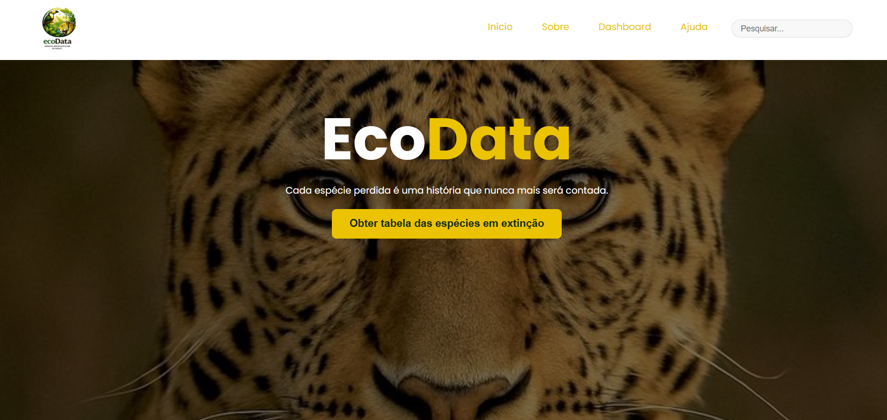
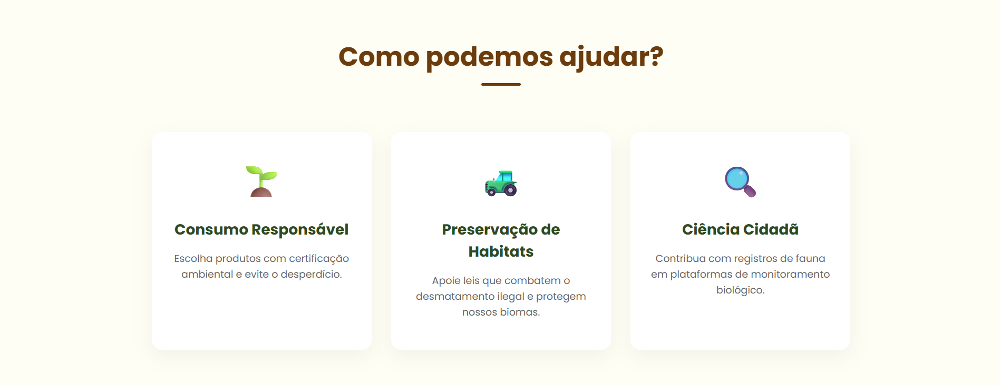
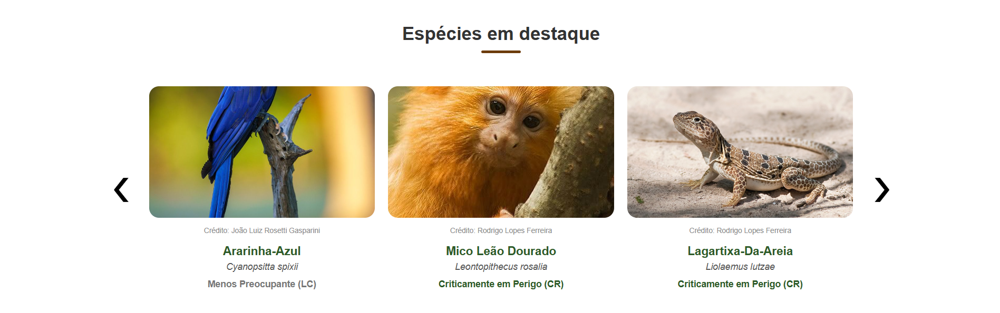
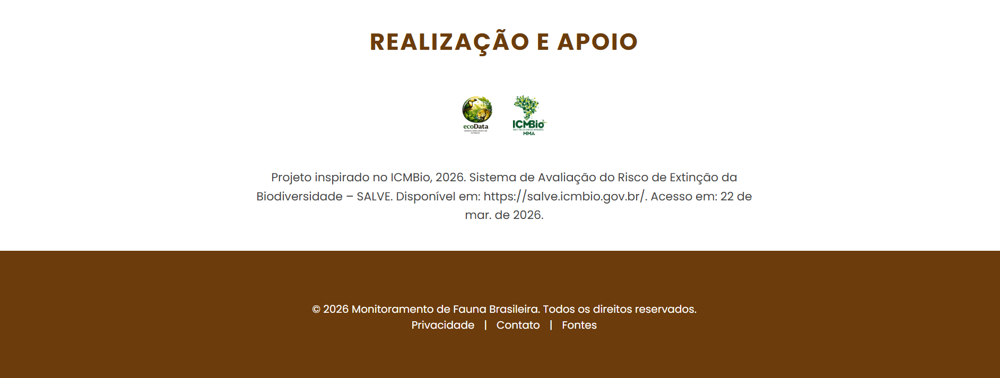
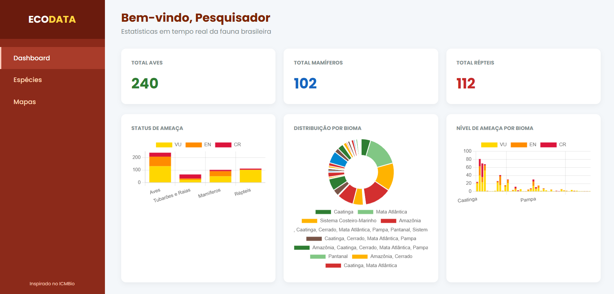
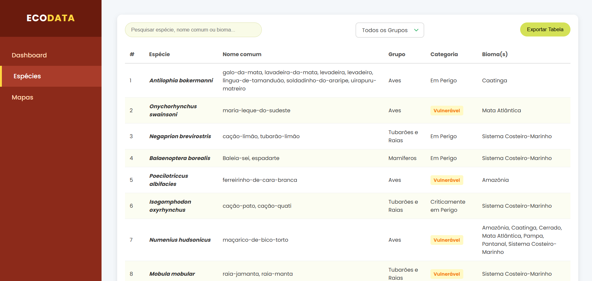
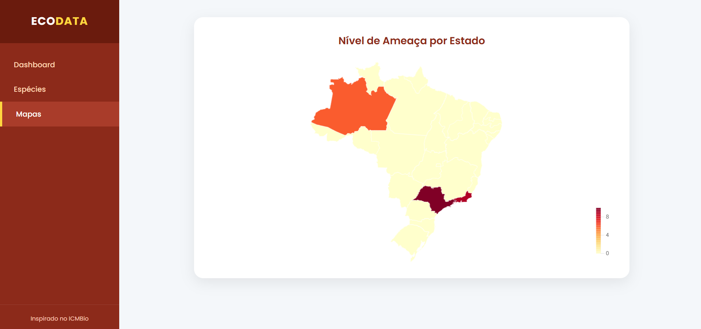

# EcoData: Estruturação e Visualização de Dados da Fauna Brasileira Ameaçada de extinção
O EcoData foi desenvolvido como um projeto prático para consolidar conhecimentos em desenvolvimento Front-end e integração com serviços Cloud (BaaS) . O objetivo principal foi aplicar conceitos de engenharia de software na resolução de um problema real: a visualização de dados ambientais.

## 🚀 Tecnologias usadas
- HTML
- CSS
- JavaScript
- Chart.js
- Firebase

# Fonte do projeto
Poppins

## 🎯 Funcionalidades
RF01 - O sistema deve gerar gráficos interativos para representar a distribuição de espécies por categoria de ameaça.

RF02 - O sistema deve exibir um mapa coroplético do Brasil, destacando a densidade de espécies ameaçadas por estado.

RF03 - O sistema deve integrar-se ao Firebase Firestore para garantir a sincronização e recuperação de dados em tempo real.

RF04 - O sistema deve possuir uma funcionalidade de importação para processar arquivos JSON e populares automaticamente como coleções do banco de dados.

RF05 - O sistema deve permitir que o usuário filtre listas de espécies por grupos específicos (Aves, Mamíferos, Répteis e Anfíbios).

RF06 - O sistema deve oferecer um campo de pesquisa para filtrar tabelas instantâneas por nome comum, nome científico ou bioma.

RF07 - O sistema deve permitir a conversão e o download dos dados exibidos na tabela para o formato CSV .

# Origem dos Dados
- Fonte dos Dados: As informações sobre as espécies ameaçadas foram extraídas do SALVE (Sistema de Avaliação do Risco de Extinção da Biodiversidade), mantidas pelo ICMBio (Instituto Chico Mendes de Conservação da Biodiversidade).

- Tratamento: Os dados originais foram processados ​​e convertidos de formatos brutos para JSON estruturado , permitindo a categorização por biomas, grupos taxonômicos e estados.

- Isenção de Responsabilidade: Esta aplicação possui fins educacionais e de portfólio.

## 📷 Preview do projeto

### Home

### Dashboard/tabela/mapa

## 👨‍💻 Autor
Kewelyn Coutinho